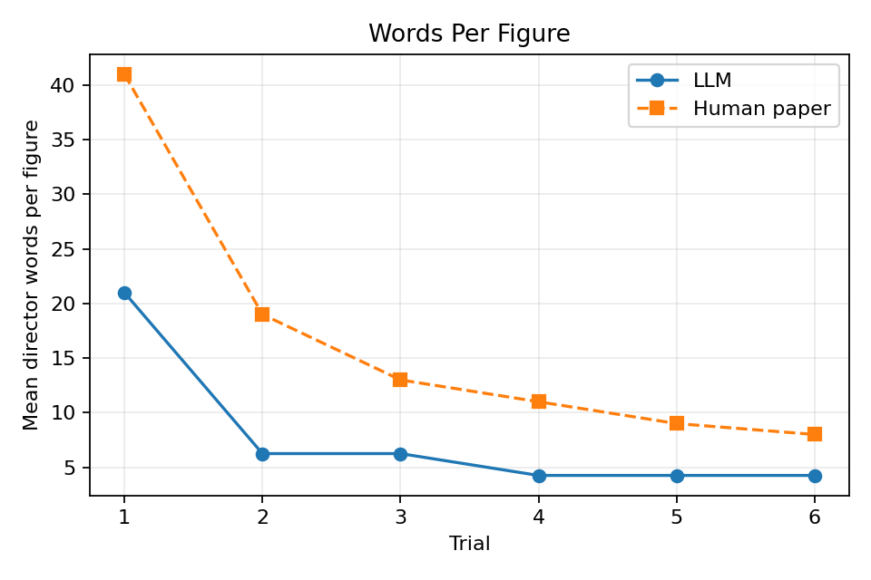
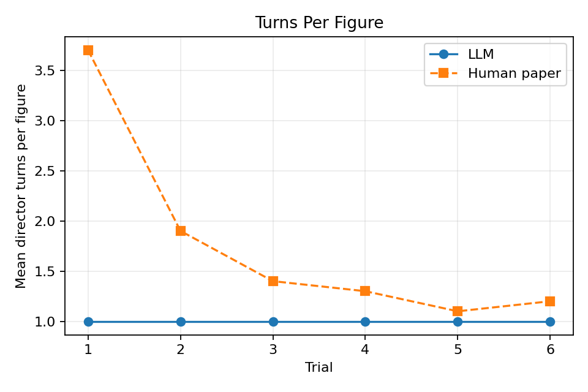
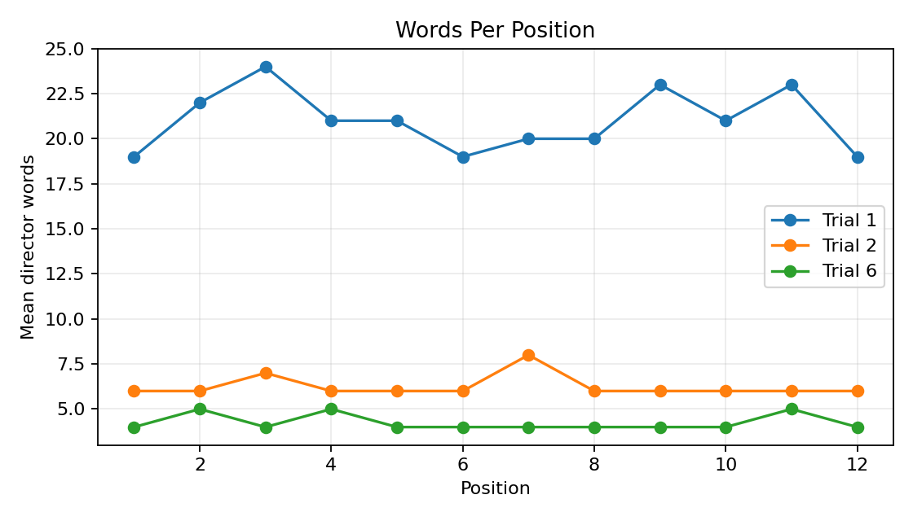
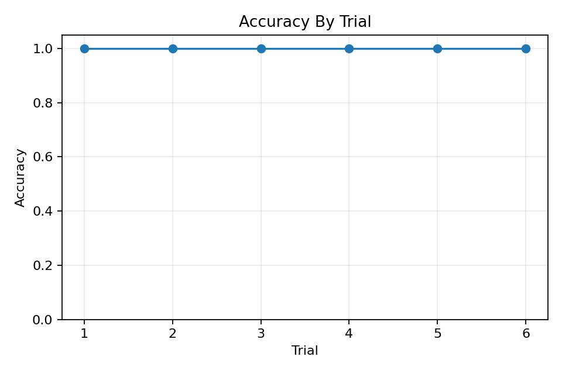
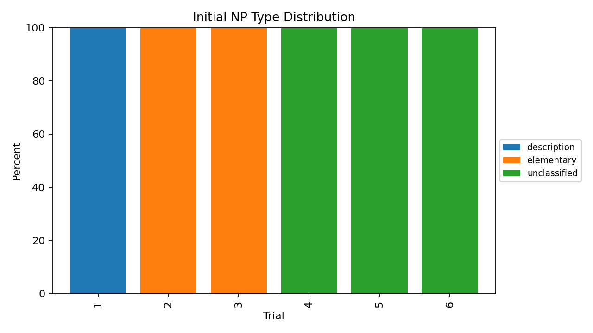

# Results Summary: sample_run

## Configuration

- Model: claude-sonnet-4-5
- Pairs: 1
- Trials: 6
- NP coding: deterministic heuristic
- Estimated cost USD: 0.074655

## LLM vs Human Headline Metrics

| trial | llm_words_per_figure | human_words_per_figure | llm_turns_per_figure | human_turns_per_figure | llm_accuracy |
| --- | --- | --- | --- | --- | --- |
| 1 | 21 | 41 | 1 | 3.7 | 1 |
| 2 | 6.25 | 19 | 1 | 1.9 | 1 |
| 3 | 6.25 | 13 | 1 | 1.4 | 1 |
| 4 | 4.25 | 11 | 1 | 1.3 | 1 |
| 5 | 4.25 | 9 | 1 | 1.1 | 1 |
| 6 | 4.25 | 8 | 1 | 1.2 | 1 |

## Basic Exchange Rate

| trial | basic_exchange_rate |
| --- | --- |
| 1 | 1 |
| 2 | 1 |
| 3 | 1 |
| 4 | 1 |
| 5 | 1 |
| 6 | 1 |

## Accuracy By Trial

| trial | accuracy |
| --- | --- |
| 1 | 1 |
| 2 | 1 |
| 3 | 1 |
| 4 | 1 |
| 5 | 1 |
| 6 | 1 |

## Per-Pair Accuracy

| pair_id | trial | accuracy |
| --- | --- | --- |
| 0 | 1 | 1 |
| 0 | 2 | 1 |
| 0 | 3 | 1 |
| 0 | 4 | 1 |
| 0 | 5 | 1 |
| 0 | 6 | 1 |

## Plots

